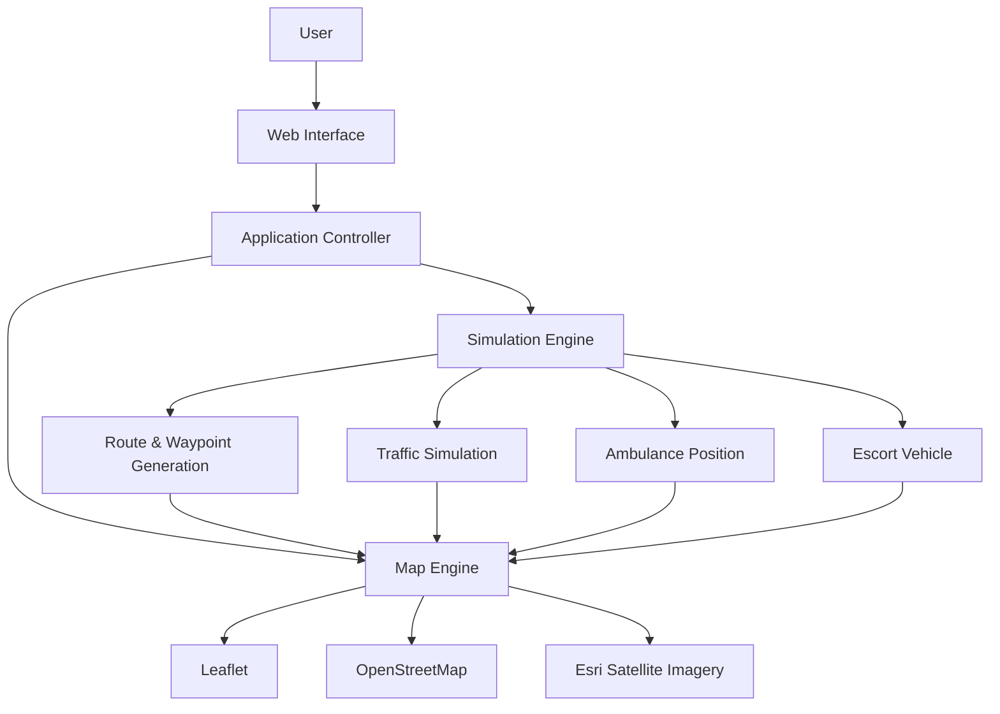

# 🚑 ResQRoute — Emergency Medical Routing & Telematics Simulator

<div align="center">


### Dynamic emergency routing and ambulance convoy simulation across Tamil Nadu.

ResQRoute is a browser-based emergency medical routing and telematics simulation platform focused on dynamic ambulance routes, traffic visualization, hospital arrival and escort-vehicle coordination.

[📂 Repository](https://github.com/Kavin-124/ResQRoute)

</div>

---

## 📌 Overview

**ResQRoute** is an interactive Emergency Medical Services (EMS) routing simulator designed around ambulance movement across Tamil Nadu.

The application models:

* District-to-district emergency routes
* GPS waypoints
* Traffic conditions
* Ambulance movement
* Escort vehicle positioning
* Hospital destinations
* Arrival and telemetry states

The project combines interactive maps with a custom simulation engine to visualize emergency transport scenarios.

---

## ✨ Key Features

### 🗺️ Tamil Nadu District Routing

The routing engine contains coordinate data for **all 38 districts of Tamil Nadu**.

Users can select origin and destination districts to generate a simulated emergency route.

The engine produces:

* Route waypoints
* Estimated distance
* Estimated travel time
* District-based route information

### 🚑 Ambulance Simulation

The application simulates ambulance movement along generated GPS waypoints.

The simulation updates the ambulance's position progressively to represent live movement.

### 🚦 Traffic Visualization

Route segments can display different traffic states:

| Indicator | Condition           |
| --------- | ------------------- |
| 🟢 Green  | Clear               |
| 🟡 Yellow | Moderate congestion |
| 🔴 Red    | Heavy congestion    |

This provides a visual representation of traffic conditions along the emergency corridor.

### 🛡️ Convoy Escort Simulation

ResQRoute includes an escort vehicle simulation where the lead vehicle maintains a controlled distance ahead of the ambulance.

The simulation targets a lead gap of approximately **65 metres**, keeping it below the project's 100-metre threshold.

### 🏥 Hospital Arrival

When the simulated ambulance reaches the destination:

* Movement stops
* Telemetry is updated
* Arrival status is displayed
* Hospital handover state can be represented

### 🛰️ Satellite / Map Views

The map interface supports switching between:

* OpenStreetMap
* Esri satellite imagery

This provides both road-map and satellite-based visualization.

---

## 🏗️ System Architecture



---

## 🛠️ Technology Stack

| Technology               | Purpose                             |
| ------------------------ | ----------------------------------- |
| HTML5                    | Application structure               |
| CSS3                     | UI and responsive styling           |
| JavaScript               | Application logic                   |
| Leaflet                  | Interactive mapping                 |
| OpenStreetMap            | Map tiles                           |
| Esri Imagery             | Satellite visualization             |
| Custom Simulation Engine | GPS movement and routing simulation |
| Vercel                   | Deployment                          |

---

## 📂 Project Structure

```text
ResQRoute/
├── index.html
├── styles.css
├── app.js
├── mapEngine.js
├── simulationEngine.js
├── package.json
├── vercel.json
└── README.md
```

### Core Modules

**`app.js`**

Handles application state, UI events and user interactions.

**`mapEngine.js`**

Controls:

* Map initialization
* Markers
* Routes
* Traffic visualization
* Hospital markers
* Satellite/map layers

**`simulationEngine.js`**

Handles:

* District coordinates
* Route generation
* GPS waypoints
* Ambulance movement
* Escort positioning
* Traffic simulation
* Arrival state

---

## 🚀 Getting Started

### Clone

```bash
git clone https://github.com/Kavin-124/ResQRoute.git
cd ResQRoute
```

### Install dependencies

```bash
npm install
```

### Start the application

```bash
npm start
```

The application runs on:

```text
http://localhost:8080
```

---
## 🌐 Live Demo & Deployment

- 🚀 **Live Web Application:** [https://res-q-route-red.vercel.app/](https://res-q-route-red.vercel.app/)
- 📂 **GitHub Repository:** [https://github.com/Kavin-124/ResQRoute](https://github.com/Kavin-124/ResQRoute)

---

## 🎯 Project Goals

ResQRoute demonstrates how web technologies can be used to visualize emergency transport scenarios through:

* Interactive maps
* GPS-style simulation
* Route visualization
* Traffic-state representation
* Ambulance telemetry
* Emergency convoy coordination

---

## 🔮 Future Improvements

* Real GPS device integration
* Real-time traffic API
* Real road routing API
* Live ambulance tracking
* WebSocket-based telemetry
* Emergency dispatch dashboard
* Multiple ambulance support
* Real hospital availability data
* Route optimization using live traffic

---

## 👨‍💻 Author

**Kavin R**

* GitHub: [@Kavin-124](https://github.com/Kavin-124)
* LinkedIn: [Kavin R](https://www.linkedin.com/in/kavinvsb)

---

## 📄 License

This project is licensed under the MIT License.
